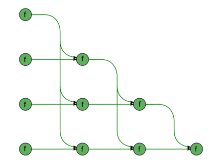

# Sistemas Lineares Triangulares
## Substituição para Frente (*Forward Substitution*)

---

<div style="width: 60%; border: 1px solid; border-radius:15px; padding:20px; position:absolute; left:10%">

Há um lado prático ainda mais predominante da álgebra linear. Em termos mais simples, **problemas lineares são solucionáveis**, enquanto problemas **não lineares não são**. É claro que alguns problemas não lineares com um pequeno número de variáveis podem ser resolvidos, mas **99,99% dos problemas não lineares multivariáveis só podem ser resolvidos ao serem reformulados como sistemas lineares**. 

</div>

<div style="position:absolute; width:20%; border-radius:50%; right:8%; top:50%;">
    
</div>

<footer>
Tucker, Alan. "The growing importance of linear algebra in undergraduate mathematics." The college mathematics journal 24.1 (1993): 3-9.
</footer>

---

## Motivação

Qual dos sistemas abaixo é mais fácil de resolver? Justifique.

<br>

$$
\begin{cases}
\; 2y_1 & & &= 4 \\
\; 3y_1 &+\; y_2 & &= 5 \\
\; 2y_1 &+\; 2y_2 &+\; y_3 &= 6
\end{cases}

\quad\quad \text{ou}\quad\quad 

\begin{cases}
\; 2y_1 &+\; y_2  &-\; 3y_3 &= 4 \\
\; 3y_1 &+\; y_2  &+\; 2y_3 &= 5 \\
\; 2y_1 &+\; 2y_2 &+\; y_3  &= 6
\end{cases}
$$

---

## Substituição para Frente (Forward Substitution)


<div style="display: flex; justify-content: space-between;">
<div style="width: 60%;">

A **Substituição para Frente** é um método utilizado para resolver sistemas de equações lineares na forma:

$$
L\mathbf{y} = \mathbf{b}
$$

Onde:
- **$L$** é uma matriz triangular inferior.
- **$\mathbf{y}$** é o vetor de incógnitas intermediárias.
- **$\mathbf{b}$** é o vetor de termos constantes (lado direito).

</div>
<div style="width: 35%; align-items: center; display: flex;">



</div>
</div>

---

## Teorema 1.3.1
<div style="display: flex; justify-content: space-between; gap: 20px;"> 
<div style="width: 60%; border: 0px solid; border-radius:15px;">

Seja $G$ uma matrix triangular. Então, $G$ é invertível se, e somente se, todos os elementos da diagonal principal de $G$ são diferentes de zero.

#### Prova
Lembre-se que $det(G) \neq 0$ se, e somente se, $G$ é invertível. Se $G$ é triangular, então $det(G) = g_{11}g_{22}\ldots g_{nn}$. Portanto, $G$ é invertível se, e somente se, $g_{ii} \neq 0$ para todo $i = 1, 2, \ldots, n$.
</div>
<div style="width: 40%; border: 1px solid; border-radius:15px; padding: 10px;">

**Conceitos Relacionados**

- ***Expansão de Laplace***
Fórmula de cálculo do determinante de uma matriz quadrada.

- ***Regra de Cramer***
Resolução de sistemas lineares utilizando determinantes.

</div>
</div>

<footer>
Watkins, David S. Fundamentals of matrix computations. John Wiley & Sons, 2004.
</footer>

---

## Teorema 1.3.1
<div style="display: flex; justify-content: space-between; gap: 20px;"> 
<div style="width: 60%; border: 0px solid; border-radius:15px;">

Seja $G$ uma matrix triangular. Então, $G$ é invertível se, e somente se, todos os elementos da diagonal principal de $G$ são diferentes de zero.

#### Prova
Lembre-se que $det(G) \neq 0$ se, e somente se, $G$ é invertível. Se $G$ é triangular, então $det(G) = g_{11}g_{22}\ldots g_{nn}$. Portanto, $G$ é invertível se, e somente se, $g_{ii} \neq 0$ para todo $i = 1, 2, \ldots, n$.
</div>
<div style="width: 40%; border: 1px solid; border-radius:15px; padding: 10px;">

### Algoritmo de Substituição

1. **Início:** 
Defina $y_1 = \frac{b_1}{l_{1,1}}$.
<br>
2. **Iteração:** 
Para $i = 2$ até $n$:
    $$y_i = \frac{1}{l_{i,i}} \left( b_i - \sum_{j=1}^{i-1} l_{i,j} y_j \right)$$

</div>
</div>

<footer>
Watkins, David S. Fundamentals of matrix computations. John Wiley & Sons, 2004.
</footer>


---

## Exercícios
1. Implemente a função `dtrsv_naive` em C.

```c
void dtrsv_naive(
  double** L, // matriz triangular inferior
  double* b,  // vetor de termos constantes
  double* y,  // vetor de incógnitas
  int n       // tamanho da matriz
);
```
2. Faça um gráfico do tempo de execução da função `dtrsv_naive` em função do tamanho da matriz $L$.
3. Qual é a complexidade computacional da função `dtrsv_naive`?
4. Compare a performance da função `dtrsv` com a função `dtrsv` da biblioteca LAPACK.

---
<!-- backgroundColor: orange -->

# PERGUNTAS?